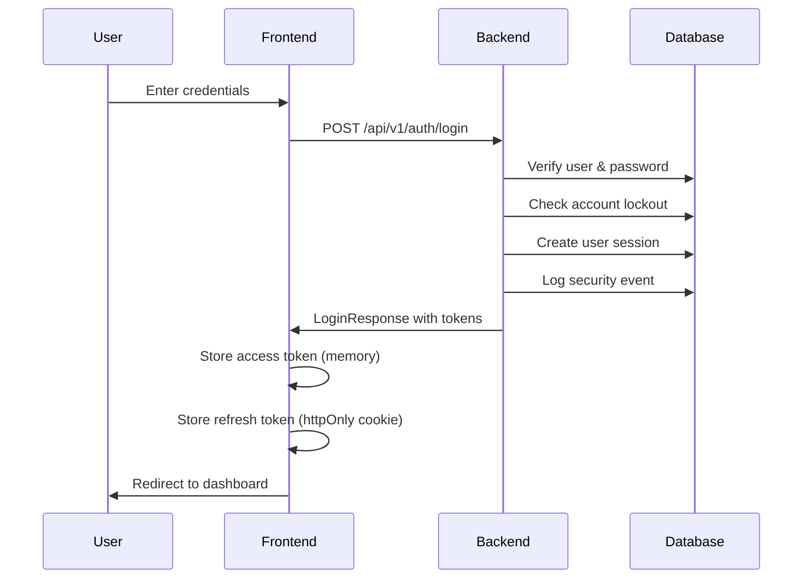

# PRD 004 - Frontend Authentication Components (MVP)

**Document Version:** 2.2  
**Created:** 2025-08-07  
**Updated:** 2025-08-08  
**Status:** Ready for Implementation  
**Related:** PRD 003 - Authentication and RBAC System (COMPLETED)

## Executive Summary

This PRD defines the essential frontend authentication components for SantaServer's MVP, providing concrete implementation guidance based on the completed backend authentication system (PRD 003). All backend APIs are implemented and tested - this document specifies exact API contracts, authentication flows, and security patterns for the frontend engineer to implement the login UI and user management interface.

## Frontend Architecture

### Technology Stack
- **Framework**: SvelteKit with static adapter
- **Language**: TypeScript
- **State Management**: Svelte stores with performance optimizations
- **API Client**: Fetch with authentication wrapper and security headers
- **Styling**: CSS with modern design system
- **Security**: CSP headers, XSS protection, secure token storage
- **Performance**: Memoized computations, lazy loading, efficient re-rendering

### Component Structure
```
src/
├── lib/
│   ├── auth/
│   │   ├── stores.ts        # Authentication state
│   │   ├── api.ts           # API client
│   │   └── types.ts         # TypeScript interfaces with user types
│   ├── components/
│   │   ├── auth/
│   │   │   ├── LoginForm.svelte
│   │   │   └── LogoutButton.svelte
│   │   ├── admin/
│   │   │   ├── UserList.svelte        # User management with type display
│   │   │   ├── UserTypeIndicator.svelte  # Visual user type indicators
│   │   │   ├── UserActions.svelte     # Type-aware user actions
│   │   │   └── ProviderSelector.svelte  # Provider filtering
│   │   └── layout/
│   │       ├── Navigation.svelte
│   │       └── AuthGuard.svelte
│   └── utils/
│       └── api.ts           # Base API client
└── routes/
    ├── (auth)/
    │   └── login/+page.svelte
    ├── (admin)/
    │   ├── users/+page.svelte        # Enhanced user management
    │   └── providers/+page.svelte    # Future provider configuration
    └── (dashboard)/
        └── +layout.svelte   # Protected routes
```

## Authentication State Management

### Core Types
```typescript
// src/lib/auth/types.ts
// CONFIRMED: Backend Enums (app/models/auth.py)

export enum UserType {
  LOCAL = 'local',   // UserTypeEnum.LOCAL
  SSO = 'sso',      // UserTypeEnum.SSO (future)
  SCIM = 'scim'     // UserTypeEnum.SCIM (future)
}

export enum ProviderType {
  SAML2 = 'saml2',     // ProviderTypeEnum.SAML2
  OIDC = 'oidc',       // ProviderTypeEnum.OIDC
  SCIM_V2 = 'scim_v2'  // ProviderTypeEnum.SCIM_V2
}

// CONFIRMED: Backend Schema (app/schemas/auth.py - UserProfile/UserResponse)
export interface User {
  id: string;           // UUID from backend
  username: string;
  email: string;
  user_type: UserType;  // 'local', 'sso', 'scim'
  
  // Profile fields (from UserProfile schema)
  first_name?: string;
  last_name?: string;
  display_name?: string;
  department?: string;
  title?: string;
  phone?: string;
  
  // Status fields (from UserResponse schema) 
  is_active: boolean;
  is_provisioned: boolean;  // Only in UserResponse
  last_login?: Date;
  created_at?: Date;        // Only in UserResponse
  updated_at?: Date;        // Only in UserResponse
  
  // Note: Backend doesn't include roles/groups in v1
  // These would be fetched separately via /users/{id}/roles endpoint (future)
}

export interface Role {
  id: string;
  name: string;
  display_name: string;
  permissions: Record<string, string[]>;
}

export interface Group {
  id: string;
  name: string;
  display_name: string;
  description?: string;
  source_type: 'local' | 'scim' | 'sso';
  external_id?: string;
  provider_name?: string;
  provider_display_name?: string;
  last_sync?: Date;
  roles: Role[];
}

export interface AuthProvider {
  id: string;
  name: string;
  display_name: string;
  provider_type: ProviderType;
  is_enabled: boolean;
  created_at: Date;
  updated_at: Date;
}

// CONFIRMED: Backend API Contract (app/schemas/auth.py)
export interface LoginRequest {
  username: string;  // Backend accepts username OR email
  password: string;  // Min 8 chars, complexity enforced backend
  // Note: remember_me not implemented in backend v1
}
```

### Authentication Store
```typescript
// src/lib/auth/stores.ts
import { writable, derived } from 'svelte/store';

interface AuthState {
  user: User | null;
  accessToken: string | null;
  isAuthenticated: boolean;
  isLoading: boolean;
  error: string | null;
  sessionExpiry: Date | null;
  lastActivity: Date | null;
}

export const authStore = writable<AuthState>({
  user: null,
  accessToken: null,
  isAuthenticated: false,
  isLoading: true,
  error: null,
  sessionExpiry: null,
  lastActivity: null
});

// Derived stores
export const user = derived(authStore, ($auth) => $auth.user);
export const isAuthenticated = derived(authStore, ($auth) => $auth.isAuthenticated);

// Memoized permission checker for performance
const permissionCache = new Map<string, boolean>();
const CACHE_EXPIRY = 5 * 60 * 1000; // 5 minutes
let lastCacheUpdate = 0;

export const hasPermission = derived(user, ($user) => 
  (resource: string, action: string) => {
    if (!$user) return false;
    
    const cacheKey = `${$user.id}:${resource}:${action}`;
    const now = Date.now();
    
    // Check cache validity and clear if expired
    if (now - lastCacheUpdate > CACHE_EXPIRY) {
      permissionCache.clear();
      lastCacheUpdate = now;
    }
    
    // Return cached result if available
    if (permissionCache.has(cacheKey)) {
      return permissionCache.get(cacheKey)!;
    }
    
    let hasAccess = false;
    
    // Check direct role permissions
    for (const role of $user.roles) {
      if (role.permissions[resource]?.includes(action)) {
        hasAccess = true;
        break;
      }
    }
    
    // Check group role permissions if not found in direct roles
    if (!hasAccess) {
      for (const group of $user.groups) {
        for (const role of group.roles) {
          if (role.permissions[resource]?.includes(action)) {
            hasAccess = true;
            break;
          }
        }
        if (hasAccess) break;
      }
    }
    
    // Cache the result
    permissionCache.set(cacheKey, hasAccess);
    return hasAccess;
  }
);

// Session monitoring
export const isSessionExpired = derived(authStore, ($auth) => {
  if (!$auth.sessionExpiry || !$auth.isAuthenticated) return false;
  return new Date() > $auth.sessionExpiry;
});

// Activity tracking for session timeout
export const trackActivity = () => {
  authStore.update(state => ({
    ...state,
    lastActivity: new Date()
  }));
};
```

## Core Components

### Login Form
```svelte
<!-- src/lib/components/auth/LoginForm.svelte -->
<script lang="ts">
  import { authActions, authError, isLoading } from '$lib/auth/stores';
  import type { LoginRequest } from '$lib/auth/types';

  let credentials: LoginRequest = {
    username: '',
    password: ''
    // remember_me removed - not implemented in backend v1
  };

  let showPassword = false;
  let validationErrors: string[] = [];

  // Frontend validation before API call
  function validateForm(): boolean {
    validationErrors = [];
    
    if (!credentials.username.trim()) {
      validationErrors.push('Username or email is required');
    }
    
    if (!credentials.password) {
      validationErrors.push('Password is required');
    } else if (credentials.password.length < 8) {
      validationErrors.push('Password must be at least 8 characters');
    }
    
    return validationErrors.length === 0;
  }

  async function handleLogin() {
    if (!validateForm()) return;
    
    try {
      await authActions.login(credentials);
      // Success handled by store - redirects to dashboard
    } catch (error) {
      // Backend errors:
      // - "Incorrect username or password" (401)
      // - "Account inactive" / "Account locked" (401)
      // Error displayed by store
    }
  }
</script>

<div class="login-form">
  <h1>Sign in to SantaServer</h1>
  
  <form on:submit|preventDefault={handleLogin}>
    <div class="field">
      <label for="username">Username</label>
      <input
        id="username"
        type="text"
        bind:value={credentials.username}
        disabled={$isLoading}
        required
      />
    </div>

    <div class="field">
      <label for="password">Password</label>
      <div class="password-input">
        <input
          id="password"
          type={showPassword ? 'text' : 'password'}
          bind:value={credentials.password}
          disabled={$isLoading}
          required
        />
        <button
          type="button"
          class="toggle-password"
          on:click={() => showPassword = !showPassword}
        >
          {showPassword ? '🙈' : '👁️'}
        </button>
      </div>
    </div>

    <!-- Remember me removed - not implemented in backend v1 -->

    <!-- Frontend validation errors -->
    {#if validationErrors.length > 0}
      <div class="validation-errors" role="alert">
        {#each validationErrors as error}
          <p class="error">{error}</p>
        {/each}
      </div>
    {/if}
    
    <!-- Backend authentication errors -->
    {#if $authError}
      <div class="auth-error" role="alert">
        {$authError}
      </div>
    {/if}

    <button type="submit" disabled={$isLoading} class="submit-btn">
      {$isLoading ? 'Signing in...' : 'Sign in'}
    </button>
  </form>
</div>
```

### Navigation with Role-Based Menu
```svelte
<!-- src/lib/components/layout/Navigation.svelte -->
<script lang="ts">
  import { user, isAuthenticated, hasPermission } from '$lib/auth/stores';
  import LogoutButton from '../auth/LogoutButton.svelte';
  
  interface NavItem {
    label: string;
    href: string;
    permission?: { resource: string; action: string };
    icon: string;
  }
  
  const navItems: NavItem[] = [
    { label: 'Dashboard', href: '/dashboard', icon: '📊' },
    { label: 'Rules', href: '/rules', permission: { resource: 'santa', action: 'read' }, icon: '📝' },
    { label: 'Approvals', href: '/approvals', permission: { resource: 'santa', action: 'approve' }, icon: '✅' },
    { label: 'Users', href: '/users', permission: { resource: 'users', action: 'read' }, icon: '👥' },
    { label: 'Groups', href: '/groups', permission: { resource: 'groups', action: 'read' }, icon: '👫' },
    { label: 'System', href: '/system', permission: { resource: 'system', action: 'configure' }, icon: '⚙️' }
  ];
</script>

{#if $isAuthenticated}
  <nav class="navigation">
    <div class="nav-brand">
      <a href="/dashboard">🎅 SantaServer</a>
    </div>
    
    <ul class="nav-menu">
      {#each navItems as item}
        {#if !item.permission || $hasPermission(item.permission.resource, item.permission.action)}
          <li>
            <a href={item.href} class="nav-link">
              <span class="nav-icon">{item.icon}</span>
              {item.label}
            </a>
          </li>
        {/if}
      {/each}
    </ul>
    
    <div class="user-menu">
      <span class="username">{$user?.username}</span>
      <LogoutButton />
    </div>
  </nav>
{/if}
```

### Route Protection
```svelte
<!-- src/lib/components/layout/AuthGuard.svelte -->
<script lang="ts">
  import { onMount } from 'svelte';
  import { goto } from '$app/navigation';
  import { page } from '$app/stores';
  import { isAuthenticated, isLoading, hasPermission, authActions } from '$lib/auth/stores';
  
  export let requiredPermission: { resource: string; action: string } | null = null;
  
  onMount(() => {
    authActions.initializeAuth();
  });
  
  $: {
    if (!$isLoading) {
      if (!$isAuthenticated) {
        const redirectUrl = `/login?redirect=${encodeURIComponent($page.url.pathname)}`;
        goto(redirectUrl);
      } else if (requiredPermission && !$hasPermission(requiredPermission.resource, requiredPermission.action)) {
        goto('/unauthorized');
      }
    }
  }
</script>

{#if $isLoading}
  <div class="loading">
    <div class="spinner"></div>
    <p>Loading...</p>
  </div>
{:else if $isAuthenticated && (!requiredPermission || $hasPermission(requiredPermission.resource, requiredPermission.action))}
  <slot />
{/if}
```

## API Integration

### Authentication API Client
```typescript
// src/lib/auth/api.ts - CONFIRMED BACKEND ENDPOINTS
import type { LoginRequest, User } from './types';
import { apiClient } from '$lib/utils/api';

// All endpoints confirmed in app/api/api_v1/endpoints/auth.py
export const authApi = {
  // POST /api/v1/auth/login - Returns LoginResponse
  async login(credentials: LoginRequest) {
    return apiClient.post('/auth/login', credentials);
  },

  // POST /api/v1/auth/logout - Requires Bearer token
  async logout() {
    return apiClient.post('/auth/logout');
  },

  // POST /api/v1/auth/logout-all - Revoke all sessions
  async logoutAll() {
    return apiClient.post('/auth/logout-all');
  },

  // POST /api/v1/auth/refresh - RefreshRequest -> TokenResponse
  async refreshToken(refreshToken: string) {
    return apiClient.post('/auth/refresh', { refresh_token: refreshToken });
  },

  // GET /api/v1/auth/profile - Returns UserProfile
  async getProfile(): Promise<User> {
    return apiClient.get('/auth/profile');
  },

  // PUT /api/v1/auth/profile - Update user profile (limited fields)
  async updateProfile(data: Partial<User>) {
    return apiClient.put('/auth/profile', data);
  },

  // POST /api/v1/auth/change-password - ChangePasswordRequest
  async changePassword(data: {
    current_password: string;
    new_password: string;
  }) {
    return apiClient.post('/auth/change-password', data);
  },

  // GET /api/v1/auth/verify - Verify token validity
  async verifyToken(): Promise<User> {
    return apiClient.get('/auth/verify');
  }
};
```

### Base API Client
```typescript
// src/lib/utils/api.ts
import { browser } from '$app/environment';
import { authStore } from '$lib/auth/stores';
import { get } from 'svelte/store';

class ApiClient {
  private baseUrl = '/api/v1';
  private csrfToken: string | null = null;

  constructor() {
    // Initialize CSRF token
    this.initializeCsrfToken();
  }

  private async initializeCsrfToken() {
    try {
      const response = await fetch('/api/v1/csrf-token');
      const data = await response.json();
      this.csrfToken = data.csrf_token;
    } catch (error) {
      console.warn('Failed to get CSRF token:', error);
    }
  }

  private getAuthHeaders(): Record<string, string> {
    const auth = get(authStore);
    const headers: Record<string, string> = {
      'Content-Type': 'application/json',
      'X-Requested-With': 'XMLHttpRequest', // CSRF protection
    };

    if (auth.accessToken) {
      headers.Authorization = `Bearer ${auth.accessToken}`;
    }

    if (this.csrfToken) {
      headers['X-CSRF-Token'] = this.csrfToken;
    }

    return headers;
  }

  private async handleResponse<T>(response: Response): Promise<T> {
    // Track activity for session management
    trackActivity();
    
    if (!response.ok) {
      // Handle token expiration
      if (response.status === 401) {
        authStore.update(state => ({
          ...state,
          isAuthenticated: false,
          user: null,
          accessToken: null,
          error: 'Session expired'
        }));
        // Clear secure storage
        this.clearTokens();
        throw new Error('Session expired');
      }
      
      const error = await response.json().catch(() => ({ 
        error: { message: `HTTP ${response.status}` } 
      }));
      throw new Error(error.error?.message || `HTTP ${response.status}`);
    }
    return response.json();
  }

  private clearTokens() {
    // Clear httpOnly cookies
    document.cookie = 'refresh_token=; expires=Thu, 01 Jan 1970 00:00:00 UTC; path=/; Secure; HttpOnly; SameSite=Strict';
    // Clear any localStorage tokens (legacy)
    localStorage.removeItem('auth_token');
    localStorage.removeItem('refresh_token');
  }

  async get<T>(endpoint: string): Promise<T> {
    const response = await fetch(`${this.baseUrl}${endpoint}`, {
      method: 'GET',
      headers: this.getAuthHeaders(),
    });
    return this.handleResponse<T>(response);
  }

  async post<T>(endpoint: string, data?: unknown): Promise<T> {
    const response = await fetch(`${this.baseUrl}${endpoint}`, {
      method: 'POST',
      headers: this.getAuthHeaders(),
      body: data ? JSON.stringify(data) : undefined,
    });
    return this.handleResponse<T>(response);
  }

  async put<T>(endpoint: string, data: unknown): Promise<T> {
    const response = await fetch(`${this.baseUrl}${endpoint}`, {
      method: 'PUT',
      headers: this.getAuthHeaders(),
      body: JSON.stringify(data),
    });
    return this.handleResponse<T>(response);
  }

  async delete<T>(endpoint: string): Promise<T> {
    const response = await fetch(`${this.baseUrl}${endpoint}`, {
      method: 'DELETE',
      headers: this.getAuthHeaders(),
    });
    return this.handleResponse<T>(response);
  }
}

export const apiClient = new ApiClient();
```

## Route Structure

### Login Page
```svelte
<!-- src/routes/(auth)/login/+page.svelte -->
<script>
  import { onMount } from 'svelte';
  import { goto } from '$app/navigation';
  import { isAuthenticated } from '$lib/auth/stores';
  import LoginForm from '$lib/components/auth/LoginForm.svelte';
  
  onMount(() => {
    if ($isAuthenticated) {
      goto('/dashboard');
    }
  });
</script>

<svelte:head>
  <title>Sign in - SantaServer</title>
</svelte:head>

<div class="login-page">
  <LoginForm />
</div>
```

### Protected Layout
```svelte
<!-- src/routes/(dashboard)/+layout.svelte -->
<script>
  import AuthGuard from '$lib/components/layout/AuthGuard.svelte';
  import Navigation from '$lib/components/layout/Navigation.svelte';
</script>

<AuthGuard>
  <div class="dashboard-layout">
    <Navigation />
    <main class="main-content">
      <slot />
    </main>
  </div>
</AuthGuard>
```

## User Type Management Components

### UserTypeIndicator Component
Visual indicator component that displays user authentication type with appropriate styling and icons.

```svelte
<!-- src/lib/components/admin/UserTypeIndicator.svelte -->
<script lang="ts">
  import { UserType } from '$lib/auth/types';
  
  export let userType: UserType;
  
  const typeConfig = {
    [UserType.LOCAL]: {
      label: 'Local',
      icon: '🔑',
      class: 'local',
      description: 'Local username/password authentication'
    },
    [UserType.SSO]: {
      label: 'SSO',
      icon: '🔐',
      class: 'sso',
      description: 'Single Sign-On authentication'
    },
    [UserType.SCIM]: {
      label: 'SCIM',
      icon: '⚡',
      class: 'scim',
      description: 'SCIM-provisioned from identity provider'
    }
  };
  
  $: config = typeConfig[userType];
</script>

<span 
  class="user-type-indicator {config.class}"
  title={config.description}
>
  <span class="type-icon">{config.icon}</span>
  <span class="type-label">{config.label}</span>
</span>

<style>
  .user-type-indicator {
    display: inline-flex;
    align-items: center;
    gap: 0.25rem;
    padding: 0.25rem 0.5rem;
    border-radius: 0.375rem;
    font-size: 0.875rem;
    font-weight: 500;
  }
  
  .local {
    background-color: #dbeafe;
    color: #1e40af;
  }
  
  .sso {
    background-color: #dcfce7;
    color: #166534;
  }
  
  .scim {
    background-color: #fef3c7;
    color: #92400e;
  }
</style>
```

### Enhanced UserList Component
User management interface with type filtering and visual indicators for different authentication types.

```svelte
<!-- src/lib/components/admin/UserList.svelte -->
<script lang="ts">
  import { onMount } from 'svelte';
  import { UserType, type User, type AuthProvider } from '$lib/auth/types';
  import UserTypeIndicator from './UserTypeIndicator.svelte';
  import UserActions from './UserActions.svelte';
  
  let users: User[] = [];
  let providers: AuthProvider[] = [];
  let loading = true;
  let selectedUserType: UserType | 'all' = 'all';
  let selectedProvider: string | 'all' = 'all';
  
  async function loadUsers() {
    loading = true;
    const params = new URLSearchParams();
    if (selectedUserType !== 'all') params.set('user_type', selectedUserType);
    if (selectedProvider !== 'all') params.set('provider_name', selectedProvider);
    
    users = await apiClient.get(`/users?${params.toString()}`);
    loading = false;
  }
  
  onMount(async () => {
    providers = await apiClient.get('/auth/providers');
    await loadUsers();
  });
</script>

<div class="user-management">
  <div class="filters">
    <select bind:value={selectedUserType} on:change={loadUsers}>
      <option value="all">All User Types</option>
      <option value={UserType.LOCAL}>Local Users</option>
      <option value={UserType.SSO}>SSO Users</option>
      <option value={UserType.SCIM}>SCIM Users</option>
    </select>
    
    <select bind:value={selectedProvider} on:change={loadUsers}>
      <option value="all">All Providers</option>
      {#each providers as provider}
        <option value={provider.name}>{provider.display_name}</option>
      {/each}
    </select>
  </div>
  
  <div class="user-table">
    <table>
      <thead>
        <tr>
          <th>User</th>
          <th>Type</th>
          <th>Provider</th>
          <th>Status</th>
          <th>Last Login</th>
          <th>Actions</th>
        </tr>
      </thead>
      <tbody>
        {#each users as user}
          <tr>
            <td>
              <div class="user-info">
                <div class="user-name">
                  {user.display_name || `${user.first_name} ${user.last_name}` || user.username}
                </div>
                <div class="user-email">{user.email}</div>
                {#if user.department}
                  <div class="user-dept">{user.department}</div>
                {/if}
              </div>
            </td>
            <td>
              <UserTypeIndicator userType={user.user_type} />
            </td>
            <td>
              {#if user.provider_display_name}
                <span class="provider-name">{user.provider_display_name}</span>
              {:else}
                <span class="no-provider">Local</span>
              {/if}
            </td>
            <td>
              <div class="status-indicators">
                <span class="status {user.is_active ? 'active' : 'inactive'}">
                  {user.is_active ? 'Active' : 'Inactive'}
                </span>
                {#if user.user_type === UserType.SCIM}
                  <span class="provisioned {user.is_provisioned ? 'yes' : 'no'}">
                    {user.is_provisioned ? 'Provisioned' : 'Pending'}
                  </span>
                {/if}
              </div>
            </td>
            <td>
              {#if user.last_login}
                {new Date(user.last_login).toLocaleDateString()}
              {:else}
                <span class="never">Never</span>
              {/if}
            </td>
            <td>
              <UserActions {user} on:userUpdated={loadUsers} />
            </td>
          </tr>
        {/each}
      </tbody>
    </table>
  </div>
</div>
```

### Type-Aware User Actions
User action component that provides different actions based on user type (local users can change passwords, SSO users cannot, etc.).

```svelte
<!-- src/lib/components/admin/UserActions.svelte -->
<script lang="ts">
  import { createEventDispatcher } from 'svelte';
  import { UserType, type User } from '$lib/auth/types';
  
  export let user: User;
  
  const dispatch = createEventDispatcher();
  
  async function toggleUserStatus() {
    await apiClient.put(`/users/${user.id}`, {
      is_active: !user.is_active
    });
    dispatch('userUpdated');
  }
  
  async function resetPassword() {
    // Only available for local users
    if (user.user_type === UserType.LOCAL) {
      // Implementation for password reset
      dispatch('userUpdated');
    }
  }
  
  async function syncUser() {
    // Only available for SCIM users
    if (user.user_type === UserType.SCIM) {
      await apiClient.post(`/users/${user.id}/sync`);
      dispatch('userUpdated');
    }
  }
</script>

<div class="user-actions">
  <button 
    class="action-btn {user.is_active ? 'deactivate' : 'activate'}"
    on:click={toggleUserStatus}
  >
    {user.is_active ? 'Deactivate' : 'Activate'}
  </button>
  
  {#if user.user_type === UserType.LOCAL}
    <button class="action-btn reset" on:click={resetPassword}>
      Reset Password
    </button>
  {/if}
  
  {#if user.user_type === UserType.SCIM}
    <button class="action-btn sync" on:click={syncUser}>
      Sync Now
    </button>
  {/if}
</div>
```

## Security Configuration

### Backend Security Settings
```typescript
// CONFIRMED: Backend security config (app/core/config.py)
const SECURITY_CONFIG = {
  // JWT Token Settings
  JWT_ACCESS_TOKEN_EXPIRE_MINUTES: 30,    // 30 minutes
  JWT_REFRESH_TOKEN_EXPIRE_DAYS: 7,       // 7 days
  
  // Account Lockout Settings
  MAX_LOGIN_ATTEMPTS: 5,                   // Lock after 5 failed attempts  
  LOCKOUT_DURATION_MINUTES: 15,           // 15 minute lockout
  
  // Password Requirements (enforced backend)
  PASSWORD_MIN_LENGTH: 8,
  PASSWORD_REQUIRE_UPPERCASE: true,
  PASSWORD_REQUIRE_LOWERCASE: true,
  PASSWORD_REQUIRE_NUMBERS: true,
  PASSWORD_REQUIRE_SPECIAL: true
};
```

### Authentication Flow (Confirmed)


## API Integration Updates

### User Management API Client
```typescript
// src/lib/admin/api.ts - CONFIRMED BACKEND ENDPOINTS
import type { User, UserType } from '../auth/types';
import { apiClient } from '$lib/utils/api';

// All endpoints confirmed in app/api/api_v1/endpoints/users.py
export const usersApi = {
  // POST /api/v1/users/ - Create user (Admin only) - Returns UserResponse
  async createUser(userData: {
    username: string;
    email: string;
    password?: string;  // Required for local users
    first_name?: string;
    last_name?: string;
    display_name?: string;
    department?: string;
    title?: string;
    phone?: string;
    user_type: string;  // 'local', 'sso', 'scim'
  }) {
    return apiClient.post('/users/', userData);
  },

  // GET /api/v1/users/ - List users with pagination (Admin only)
  async getUsers(params?: {
    skip?: number;     // Default: 0
    limit?: number;    // Default: 50, max: 100
  }): Promise<User[]> {
    const queryParams = new URLSearchParams();
    if (params?.skip) queryParams.set('skip', String(params.skip));
    if (params?.limit) queryParams.set('limit', String(params.limit));
    return apiClient.get(`/users/?${queryParams.toString()}`);
  },

  // GET /api/v1/users/{user_id} - Get user by ID (Admin only)
  async getUser(userId: string): Promise<User> {
    return apiClient.get(`/users/${userId}`);
  },

  // PUT /api/v1/users/{user_id} - Update user (Admin only)
  async updateUser(userId: string, data: {
    email?: string;
    first_name?: string;
    last_name?: string;
    display_name?: string;
    department?: string;
    title?: string;
    phone?: string;
    is_active?: boolean;
  }) {
    return apiClient.put(`/users/${userId}`, data);
  },

  // DELETE /api/v1/users/{user_id} - Deactivate user (Admin only)
  async deactivateUser(userId: string) {
    return apiClient.delete(`/users/${userId}`);
  }
};
```

## Styling System

### CSS Variables
```css
/* src/app.css */
:root {
  --color-primary: #2563eb;
  --color-surface: #ffffff;
  --color-background: #f8fafc;
  --color-text-primary: #1e293b;
  --color-text-secondary: #64748b;
  --color-border: #e2e8f0;
  --color-error: #dc2626;
  --color-success: #16a34a;
  
  --border-radius: 0.375rem;
  --shadow: 0 1px 3px 0 rgb(0 0 0 / 0.1);
  --transition: 0.2s ease;
}

/* Base styles */
body {
  font-family: system-ui, sans-serif;
  line-height: 1.5;
  color: var(--color-text-primary);
  background-color: var(--color-background);
  margin: 0;
}

/* Form styles */
.field {
  margin-bottom: 1rem;
}

.field label {
  display: block;
  margin-bottom: 0.25rem;
  font-weight: 500;
}

.field input {
  width: 100%;
  padding: 0.5rem;
  border: 1px solid var(--color-border);
  border-radius: var(--border-radius);
  transition: border-color var(--transition);
}

.field input:focus {
  outline: none;
  border-color: var(--color-primary);
}

/* Button styles */
.submit-btn {
  width: 100%;
  padding: 0.75rem;
  background-color: var(--color-primary);
  color: white;
  border: none;
  border-radius: var(--border-radius);
  font-weight: 500;
  cursor: pointer;
  transition: opacity var(--transition);
}

.submit-btn:disabled {
  opacity: 0.6;
  cursor: not-allowed;
}
```

## IMPLEMENTATION GUIDE

### PHASE 1: Core Authentication (Week 1)
**CONFIRMED BACKEND ENDPOINTS AVAILABLE**

#### 1.1 Login Implementation
```bash
# Required API endpoints (all implemented):
POST /api/v1/auth/login      # LoginRequest -> LoginResponse
GET  /api/v1/auth/profile    # Get current user
POST /api/v1/auth/logout     # Logout current session
GET  /api/v1/auth/verify     # Verify token validity
```

#### 1.2 Frontend Tasks
- [ ] Implement `LoginForm.svelte` with validation
- [ ] Create `authStore` with JWT token management
- [ ] Build `apiClient` with Bearer token headers
- [ ] Add `AuthGuard` component for route protection
- [ ] Implement automatic token refresh

#### 1.3 Authentication Flow (CONFIRMED)
1. User enters credentials → Frontend validation
2. `POST /auth/login` → Backend validates & creates session
3. Backend returns `{ access_token, refresh_token, user }`
4. Frontend stores tokens (memory + httpOnly cookie pattern)
5. All subsequent API calls include `Authorization: Bearer {token}`
6. Token refresh handled automatically in `apiClient`

### PHASE 2: User Management (Week 2)
**CONFIRMED BACKEND ENDPOINTS AVAILABLE**

#### 2.1 Admin User Management
```bash
# Admin endpoints (all implemented, require admin role):
GET    /api/v1/users/              # List users with pagination
POST   /api/v1/users/              # Create user
GET    /api/v1/users/{user_id}     # Get user details
PUT    /api/v1/users/{user_id}     # Update user
DELETE /api/v1/users/{user_id}     # Deactivate user
```

#### 2.2 Frontend Tasks
- [ ] Build `UserList.svelte` with pagination
- [ ] Create `UserTypeIndicator.svelte` for visual user types
- [ ] Implement `CreateUserForm.svelte` with validation
- [ ] Add role-based navigation and permissions
- [ ] Build user editing and deactivation flows

### PHASE 3: Security & Polish (Week 3)

#### 3.1 Security Features
- [ ] Implement session timeout (30 min access, 7 day refresh)
- [ ] Add account lockout display (5 attempts = 15 min lockout)
- [ ] Implement logout from all sessions
- [ ] Add password change functionality
- [ ] Input sanitization and XSS protection

#### 3.2 User Experience
- [ ] Loading states and error handling
- [ ] Toast notifications for actions
- [ ] Responsive design and accessibility
- [ ] Password strength indicators
- [ ] Remember login state between browser sessions

### Backend Integration Notes
- **No Role/Permission System**: Backend doesn't implement RBAC yet - use simple admin/user check
- **User Types**: Only 'local' type functional - 'sso'/'scim' are placeholders
- **Password Requirements**: 8+ chars, enforced server-side
- **Session Management**: JWT with JTI tracking for proper revocation
- **Error Handling**: Standard HTTP status codes with descriptive messages

### Token Management Strategy (CONFIRMED)
- **Access tokens**: Store in memory only (30 min lifetime)
- **Refresh tokens**: httpOnly cookies (7 day lifetime) 
- **Automatic refresh**: Implemented in `apiClient` interceptor
- **Session timeout**: Track activity, warn before expiry
- **Logout**: Revokes server-side session + clears client tokens

## Security Enhancements

### XSS Protection
```typescript
// Input sanitization utility
import DOMPurify from 'isomorphic-dompurify';

export const sanitizeInput = (input: string): string => {
  return DOMPurify.sanitize(input, { 
    ALLOWED_TAGS: [], 
    ALLOWED_ATTR: [] 
  });
};

// Secure HTML rendering
export const renderSafeHTML = (html: string): string => {
  return DOMPurify.sanitize(html, {
    ALLOWED_TAGS: ['b', 'i', 'em', 'strong', 'p', 'br'],
    ALLOWED_ATTR: []
  });
};
```

### Content Security Policy
```typescript
// CSP configuration for production
export const cspConfig = {
  'default-src': ["'self'"],
  'script-src': ["'self'", "'unsafe-inline'"], // Minimize unsafe-inline
  'style-src': ["'self'", "'unsafe-inline'"],
  'img-src': ["'self'", "data:", "https:"],
  'connect-src': ["'self'"],
  'font-src': ["'self'"],
  'object-src': ["'none'"],
  'media-src': ["'self'"],
  'frame-src': ["'none'"]
};
```

### Session Security
```typescript
// Enhanced session management
export const sessionManager = {
  SESSION_TIMEOUT: 30 * 60 * 1000, // 30 minutes
  ABSOLUTE_TIMEOUT: 8 * 60 * 60 * 1000, // 8 hours
  
  checkSessionValidity(): boolean {
    const auth = get(authStore);
    if (!auth.isAuthenticated || !auth.lastActivity) return false;
    
    const now = new Date();
    const timeSinceActivity = now.getTime() - auth.lastActivity.getTime();
    
    return timeSinceActivity < this.SESSION_TIMEOUT;
  },
  
  extendSession(): void {
    if (this.checkSessionValidity()) {
      trackActivity();
    } else {
      this.endSession();
    }
  },
  
  endSession(): void {
    authStore.update(state => ({
      ...state,
      isAuthenticated: false,
      user: null,
      accessToken: null,
      sessionExpiry: null,
      error: 'Session expired due to inactivity'
    }));
  }
};
```

## Performance Optimizations

### Component Lazy Loading
```typescript
// Lazy load admin components
export const LazyUserList = lazy(() => import('./admin/UserList.svelte'));
export const LazyGroupManagement = lazy(() => import('./admin/GroupManagement.svelte'));
export const LazyRoleManagement = lazy(() => import('./admin/RoleManagement.svelte'));
```

### Efficient State Updates
```typescript
// Optimized user list with virtual scrolling
export class VirtualizedUserList {
  private itemHeight = 60;
  private containerHeight = 400;
  private visibleCount = Math.ceil(this.containerHeight / this.itemHeight);
  
  getVisibleItems(users: User[], scrollTop: number): User[] {
    const startIndex = Math.floor(scrollTop / this.itemHeight);
    const endIndex = Math.min(startIndex + this.visibleCount, users.length);
    return users.slice(startIndex, endIndex);
  }
}
```

### Input Validation Framework
```typescript
// Comprehensive input validation
import { z } from 'zod';

export const loginSchema = z.object({
  username: z.string()
    .min(3, 'Username must be at least 3 characters')
    .max(50, 'Username must be less than 50 characters')
    .regex(/^[a-zA-Z0-9._-]+$/, 'Username contains invalid characters'),
  password: z.string()
    .min(8, 'Password must be at least 8 characters')
    .regex(/^(?=.*[a-z])(?=.*[A-Z])(?=.*\d)(?=.*[@$!%*?&])[A-Za-z\d@$!%*?&]/, 
           'Password must contain uppercase, lowercase, number, and special character')
});

export const validateInput = <T>(schema: z.ZodSchema<T>, data: unknown): T => {
  const result = schema.safeParse(data);
  if (!result.success) {
    throw new Error(result.error.issues[0].message);
  }
  return result.data;
};
```

## Testing & Quality Assurance

### Development Commands

**Frontend Development**:
```bash
# Package management (use yarn as specified)
yarn install                    # Install dependencies
yarn add package-name          # Add dependency
yarn add -D package-name       # Add dev dependency

# Code quality (configured for 120 char line length)
yarn run lint                  # ESLint + TypeScript linting  
yarn run format                # Prettier formatting
yarn run check                 # TypeScript type checking

# Testing
yarn run test:unit             # Jest unit tests
yarn run test:e2e              # Playwright E2E tests
```

**Backend Testing** (for reference):
```bash
# All tests are passing (50/50)
uv run pytest                  # Run all tests
uv run pytest -v tests/test_auth_endpoints.py  # Specific tests
uv run black app/ tests/       # Code formatting
uv run flake8 app/ tests/      # Linting (120 chars)
```
```

## TESTING CHECKLIST

### Authentication Tests
- [ ] Valid login redirects to dashboard
- [ ] Invalid credentials show error message
- [ ] Account lockout after 5 failed attempts
- [ ] Locked account shows appropriate message
- [ ] Token refresh works automatically
- [ ] Logout clears session and redirects
- [ ] Protected routes redirect to login
- [ ] Session expires after 30 minutes inactivity

### User Management Tests (Admin)
- [ ] User list displays with pagination
- [ ] Create user form validates inputs
- [ ] User type indicators display correctly
- [ ] Update user saves changes
- [ ] Deactivate user removes access
- [ ] Admin-only endpoints return 403 for regular users

### Security Tests
- [ ] XSS protection in user inputs
- [ ] CSRF protection on state changes
- [ ] SQL injection prevention
- [ ] Password complexity validation
- [ ] Session hijacking protection
- [ ] Proper error message handling (no sensitive data)

---

**READY FOR IMPLEMENTATION**: All backend APIs are built, tested, and documented. Frontend engineer can begin Phase 1 immediately with confidence in the backend contracts.